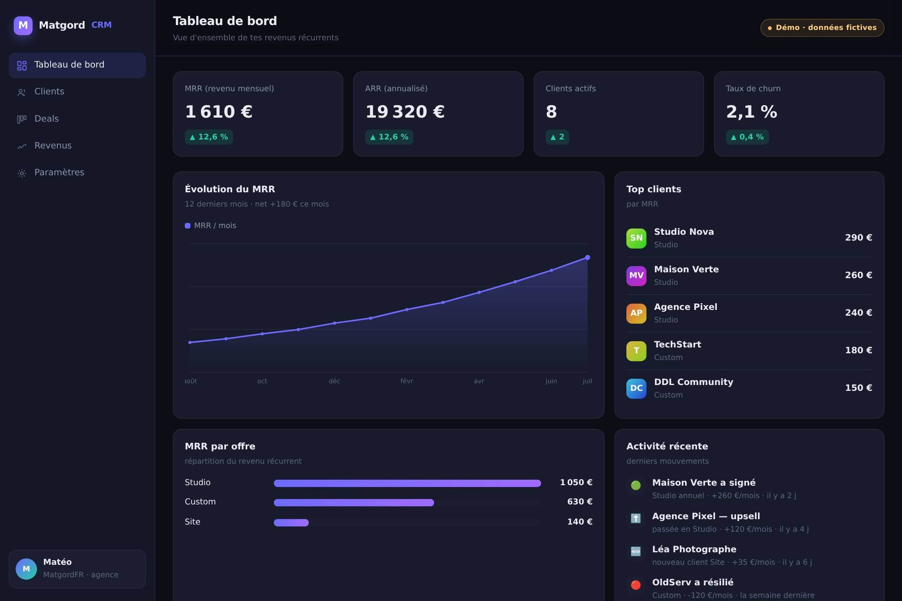

# MatgordCRM — démo (CRM + MRR)

Démo vitrine d'un **CRM avec suivi du MRR** (revenu mensuel récurrent), pensé pour une petite agence / un freelance.
Un seul fichier, **zéro dépendance**, tout est en vanilla JS — graphiques compris.

> ⚠️ **Projet démo.** Toutes les données (clients, deals, revenus) sont **fictives**. C'est une vitrine de savoir-faire, pas un produit en production.

## Ce que ça montre

- **Tableau de bord** — KPIs (MRR, ARR, clients actifs, taux de churn) avec évolution, courbe de MRR sur 12 mois, top clients, MRR par offre, activité récente.
- **Clients** — table (offre, MRR, statut, ancienneté).
- **Deals** — pipeline en kanban (lead → en discussion → gagné / perdu).
- **Revenus** — nouveau MRR, churn, MRR net, répartition par offre, mouvements sur 12 mois.
- Responsive (sidebar rétractable sur mobile), thème sombre, accessible au clavier.

## Stack

- HTML + CSS + **JavaScript vanilla**, aucun framework, aucune librairie externe.
- Les graphiques (aire, barres) sont dessinés à la main en **SVG** à partir des données.
- 100 % statique → s'ouvre directement dans un navigateur ou se sert par GitHub Pages.

## Lancer en local

Ouvre simplement `index.html` dans ton navigateur. C'est tout.

## Démo en ligne

👉 https://matgordfr.github.io/matgord-crm-demo/

## Auteur

Réalisé par **MatgordFR** — dev indépendant (bots Discord, sites, IA).
Portfolio : https://matgord.com · GitHub : https://github.com/MatgordFR

## Licence

[ISC](LICENSE) — libre d'usage.
